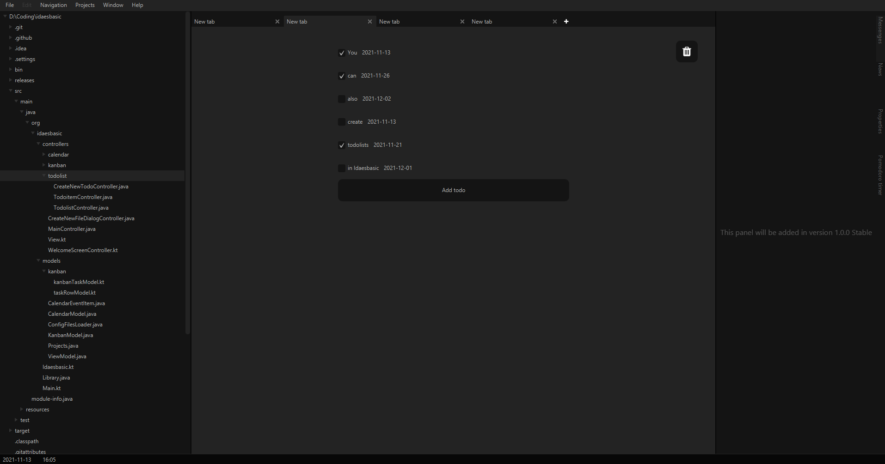

 

  

  godot, javafx, python, html, css, kotlin, java, gdscript, javascript

___

### Who is Ben Herbst?
Ben Herbst is a **programmer**, **designer**, **musican**, **digital painter**.

He **started to learn programming with 8 years** and got his first Laptop with Ubuntu with 6 years.

He started a ton of **Godot and Javafx projects**.

He is good in creating games.

He knows how to create **stable and reliable user interfaces**.

___

### Projects he created

- SoundBox:

  [https://github.com/BenHerbst/SoundBox/](https://github.com/BenHerbst/SoundBox/)

  _You music player. Play music as simple as possible._

  _The player is only one file with less then 150 lines of code._

- Idaesbasic:

  [https://github.com/BenHerbst/Idaesbasic/](https://github.com/BenHerbst/Idaesbasic/)
  
  
  [https://www.softpedia.com/get/Office-tools/Other-Office-Tools/Idaesbasic.shtml](https://www.softpedia.com/get/Office-tools/Other-Office-Tools/Idaesbasic.shtml)
  
  
  
  _Your planner. Plan anything here._
  
  _It is a stable and reliable desktop app._

- A ton of other projects not published yet, where he works every single day on

___

### Where to find him?

On Github: [https://github.com/BenHerbst](https://github.com/BenHerbst)

On Dev.to: [https://dev.to/benherbst](https://dev.to/benherbst)
