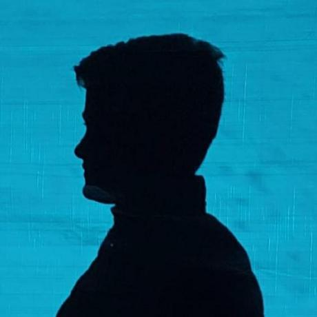

## Ben Herbst

**godot, javafx, python, html, css, kotlin, java, gdscript, javascript**

___

Ben Herbst is a **programmer**, **designer**, **musican**, **digital painter**.

He **started to learn programming with 8 years** and got his first Laptop with Ubuntu with 6 years.

He started a ton of **Godot and Javafx projects**.

He is good in creating games.

He knows how to create **stable and reliable user interfaces**.

___

Where to find him?

On Github: https://github.com/BenHerbst
On Dev.to: https://dev.to/benherbst
